# ChatNyto internals

A map of how the app is put together and how a message, a call and an
identity actually move through it.

Written once, on request, from the code as it stands. It is **not**
regenerated when the code changes — if it has drifted, ask for it to be
redone rather than trusting it.

- [1. The shape of the app](#1-the-shape-of-the-app)
- [2. What travels over MQTT](#2-what-travels-over-mqtt)
- [3. Sending a message](#3-sending-a-message)
- [4. Receiving a message](#4-receiving-a-message)
- [5. Keys, and where each one comes from](#5-keys-and-where-each-one-comes-from)
- [6. Accounts and identities](#6-accounts-and-identities)
- [7. A call, and the three roads its audio can take](#7-a-call-and-the-three-roads-its-audio-can-take)
- [8. Staying reachable when the app is closed](#8-staying-reachable-when-the-app-is-closed)
- [9. Joining a network](#9-joining-a-network)
- [10. What is stored, and where](#10-what-is-stored-and-where)
- [11. The server side](#11-the-server-side)
- [12. The AI side](#12-the-ai-side)

---

## 1. The shape of the app

Four ideas hold the whole thing up:

1. **A broker is a dumb pipe.** It sees ciphertext and topic names, nothing
   else. Any MQTT broker will do — a server, mosquitto on a laptop, the
   ESP32 in the LoRa box.
2. **An account is its key pair.** Not a row in a database somewhere. That
   one fact is what makes the same identity work on several devices, several
   identities work on one device, and deduplication trivial.
3. **Nothing needs configuring.** Presence announcements find people;
   published profiles find networks; the app asks the server, not the user.
4. **Offline is the normal case**, not an error state.

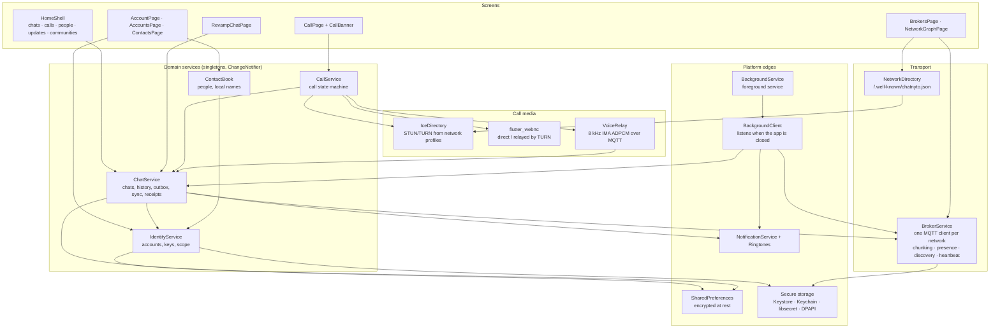

Note the one-way arrows out of `Transport`: nothing below the line knows
about screens. `BrokerService` exposes two callbacks (`onChatMessage`,
`onHeartbeat`) and `ChatService` claims them — that is the only seam
between the wire and the app.

---

## 2. What travels over MQTT

Four topic families, and only two of them carry anything private.

| Topic | Retained | Payload | Encrypted |
|---|---|---|---|
| `chatnyto/presence/<fingerprint>` | yes | `PublicIdentity` JSON — name, both public keys, picture, self-signature | no (all public by definition, and signed) |
| `chatnyto/chat/dm/<fpA>--<fpB>` | no | AES-256-GCM envelope | yes, X25519 ECDH between the pair |
| `chatnyto/chat/group/<slug>` | no | AES-256-GCM envelope | yes, key derived from the passphrase or the topic |
| `chatnyto/groups/<slug>` | yes | public group advertisement | no |

The DM topic name is the two fingerprints sorted and joined, so both sides
compute the same one without agreeing on anything.

Every client subscribes to `chatnyto/chat/#`, which means **the broker
echoes your own publications back to you**. Several things in the code exist
only because of that; each is marked in place.

### Inside an envelope

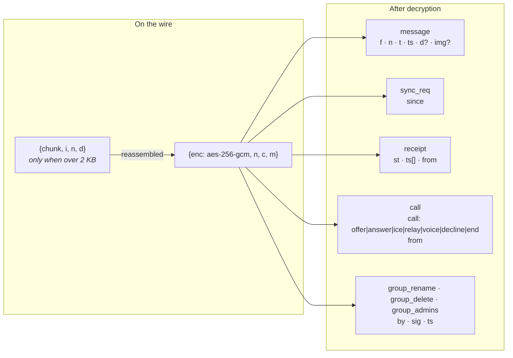

Two things worth knowing about that picture:

- **The chunk wrapper is outside the encryption**, and has to be: the
  receiver must put the pieces back together before it has anything it can
  decrypt. It leaks only a length, which the packet sizes leaked anyway.
- **`type` is written last** when a call signal is assembled. The payload
  carries keys of its own — an SDP offer has a `type` too — and if it could
  overwrite the envelope's kind, the other side files a ring away as an
  unreadable chat message and the phone never rings. It did, once.

---

## 3. Sending a message

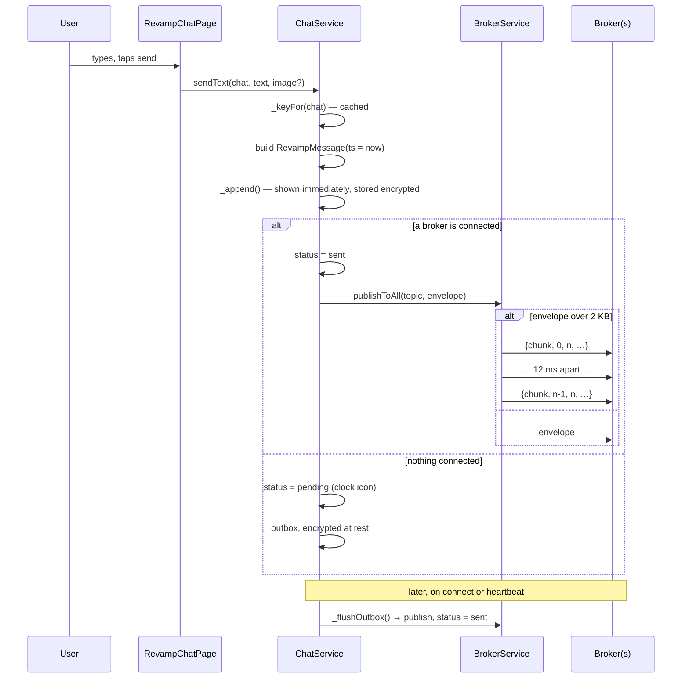

The message appears in the conversation **before** anything is published,
and is stored whether or not it can be sent. Offline is not a failure here;
it is the same path with one branch taken differently.

---

## 4. Receiving a message

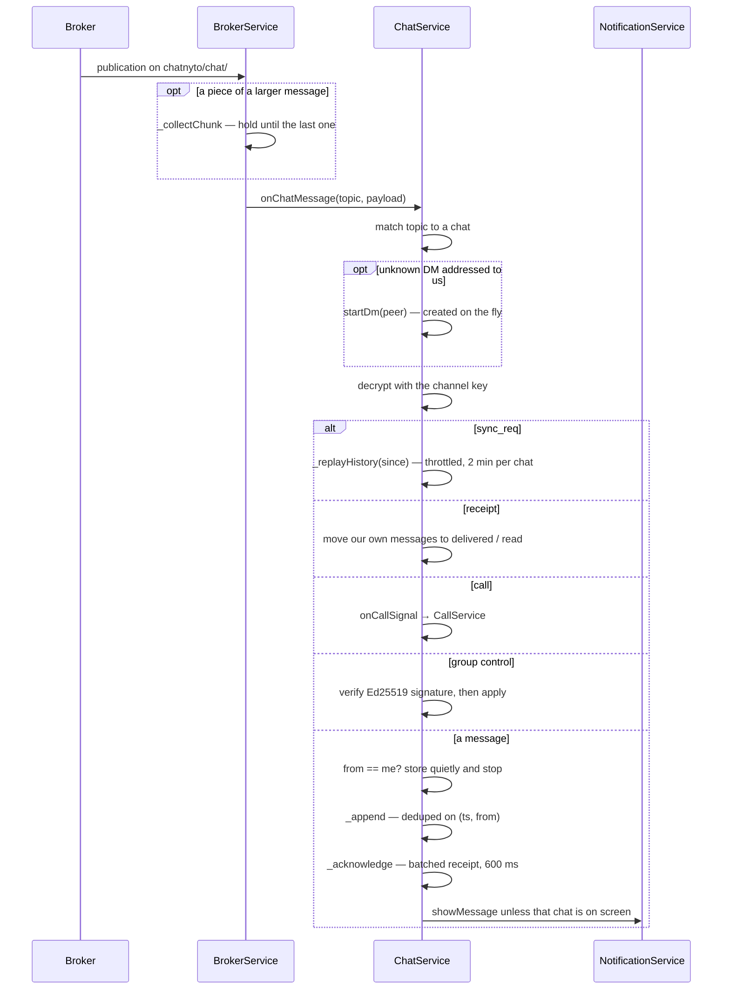

Two details that are easy to miss:

- **Dedup is `(ts, from)`.** That is what makes the broker's echo, a replay
  from the sync protocol, and a genuine resend all harmless.
- **Receipts are batched.** Catching up after a day offline delivers a whole
  conversation at once, and a separate publish per message would answer a
  burst with a burst.

### The sync protocol

There is no server holding history, so the clients hold it for each other.

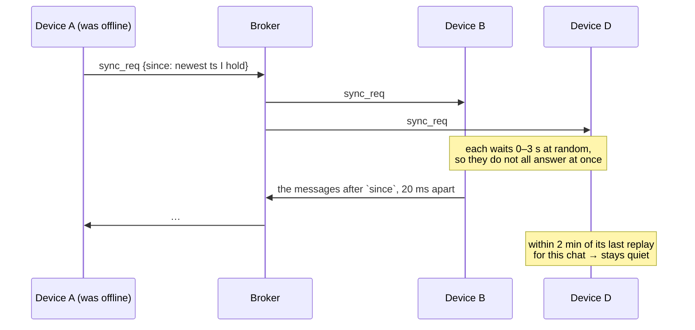

---

## 5. Keys, and where each one comes from

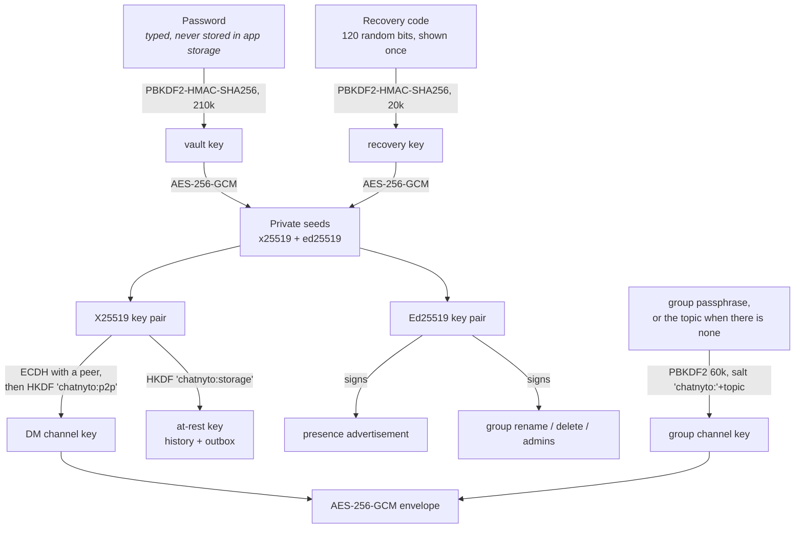

Consequences that fall straight out of this shape:

- **A broker operator can read nothing.** They hold no key material at all.
- **Forgetting the password loses everything** unless the recovery code was
  kept. That is a property of the design, not an oversight — anything that
  let the app reopen an account without either secret would be a back door.
- **A public group is only private from the broker**, not from anyone who
  knows its name: the key comes from the topic. A passphrase is what makes a
  group actually private.
- **Two devices holding the same account derive the same at-rest key**, so
  each can read what it stored itself. History is not synchronised by
  copying files; it is replayed over the sync protocol.

---

## 6. Accounts and identities

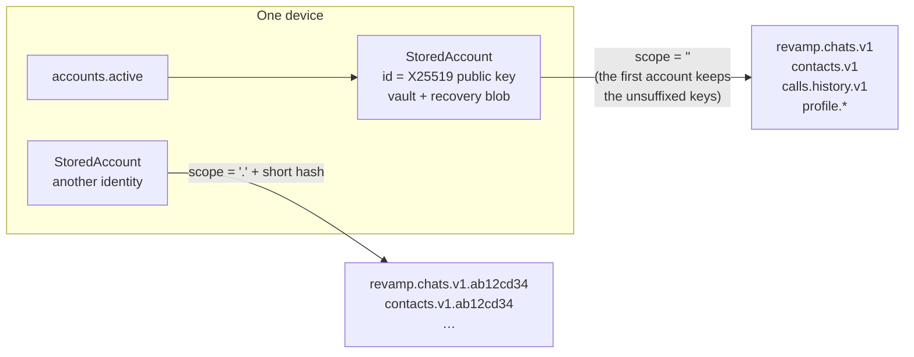

The account **id is the X25519 public key**, which is why importing an
account the device already holds refreshes it instead of duplicating it, and
why the same identity on three devices is one account rather than three.

Storage is separated by a `scope` suffix. The first account on a device gets
the empty scope so that a device which only ever has one account keeps the
simple layout — and so the migration from the single-identity build moved no
data at all.

Switching identity has to drop the **in-memory** copies as well as pointing
at different keys; that is what `forgetAccountState()` is for. Getting only
half of that right is why a second identity used to show the first one's
chats until the app was restarted.

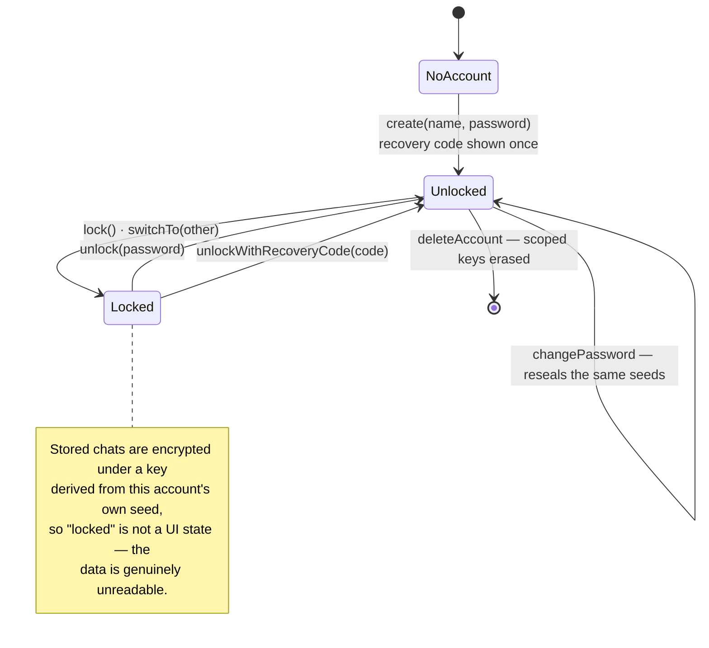

---

## 7. A call, and the three roads its audio can take

Signalling always goes over MQTT, inside the pair's own encrypted channel.
Only the audio has choices.

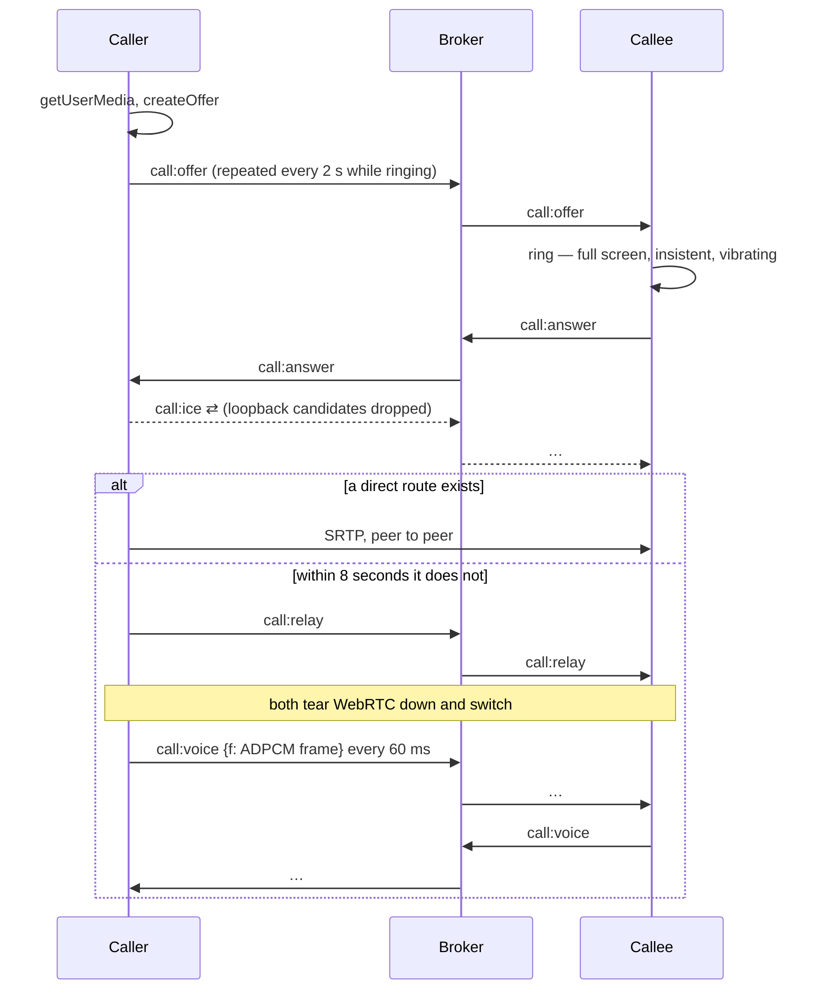

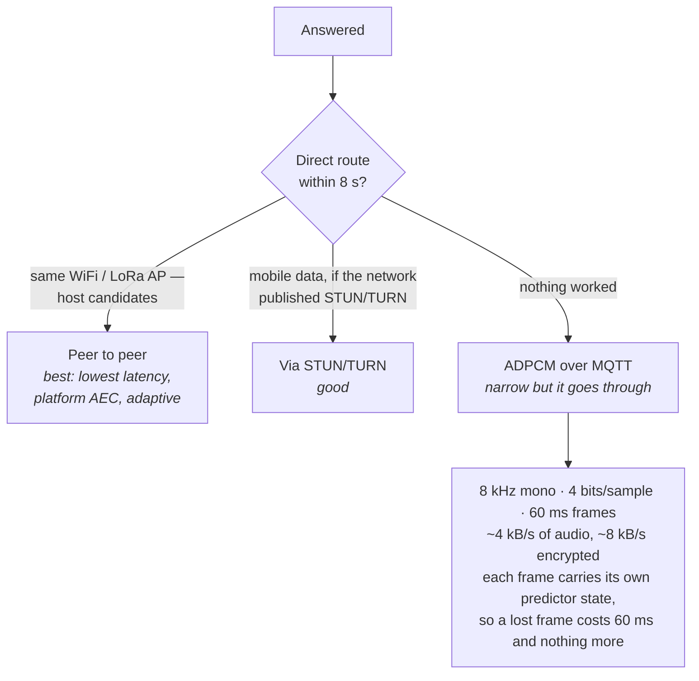

Why each piece is there:

- **The repeated offer** costs nothing (signalling is tiny) and buys two
  things: a lost packet no longer kills the call, and a phone whose app was
  closed can be woken by the ring and still find the call waiting.
- **STUN is not optional over mobile data.** With none at all, a phone
  behind carrier NAT never learns an address the other side could dial, so
  the call can *never* connect — it just says "Connecting…" forever. That
  was the bug.
- **Loopback ICE candidates are filtered.** They can never reach another
  device, but ICE still pairs and times out on them. Removing them took a
  measured 32 seconds down to 0.4.
- **The relay is Android and iOS only.** Raw capture and playback have no
  Linux build, so a desktop has the first two roads and not the third.

---

## 8. Staying reachable when the app is closed

The hardest part of the whole app, because it is really a question about
Android rather than about ChatNyto.

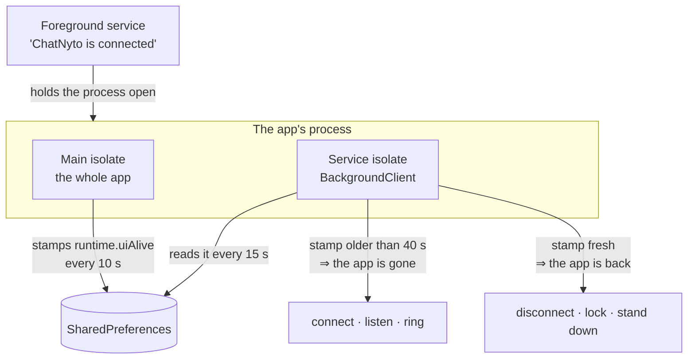

Only one isolate is ever the client, because two would notify everything
twice and — worse — write the same preferences file at the same time.

The service isolate is deliberately **less** than the app:

| | App | Service isolate |
|---|---|---|
| Connects to brokers | yes | yes, when the app is gone |
| Decrypts what arrives | yes | yes |
| Raises notifications | yes | yes |
| **Stores messages** | yes | **no** |
| **Answers calls** | yes | **no** |

Both "no"s are on purpose:

- **It writes nothing.** Losing history to two isolates racing on one file
  would be a far worse bug than the one being fixed, and the cost is small:
  when the app opens, `sync_req` asks the other side to replay what was
  missed. That protocol already exists for exactly this.
- **It does not answer.** Answering needs a microphone, a screen, and the
  call machinery. Instead it rings with a full-screen intent, which brings
  the app up — and because the caller repeats its offer, the app arrives to
  find the call still waiting.

```mermaid
sequenceDiagram
    participant C as Caller
    participant M as Broker
    participant S as Service isolate
    participant A as The app
    participant U as User

    Note over A: closed; process restarted by the service
    C->>M: call:offer
    M->>S: call:offer
    S->>S: decrypt, recognise a ring
    S->>U: full-screen notification + ringtone<br/><i>no Answer button — it could not honour one</i>
    U->>A: taps, or the full-screen intent opens it
    A->>A: unlock, connect, stamp runtime.uiAlive
    C->>M: call:offer (still repeating)
    M->>A: call:offer
    A->>U: the real call screen, Answer / Decline
    S->>S: next tick: stamp is fresh → stands down
```

There is one more layer, and it is not code: **manufacturer battery
saving**. A foreground service is supposed to keep a process alive and on
stock Android it does; OEM layers will close it anyway. That is why the
settings page offers the battery exemption, and why it only appears when the
phone has not granted it.

---

## 9. Joining a network

The user should only ever type the address they already know.

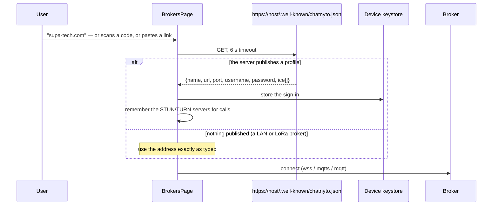

This is why the Add-network dialog has no password field. The credential
goes from HTTPS straight into the platform keystore; it is never displayed,
never typed, and never written to the app's own preferences.

It is also what makes a QR code safe to show to a room: the code carries the
address alone, and the other person's app fetches its own sign-in. Including
the credential in the code is still possible, but it is a deliberate switch.

---

## 10. What is stored, and where

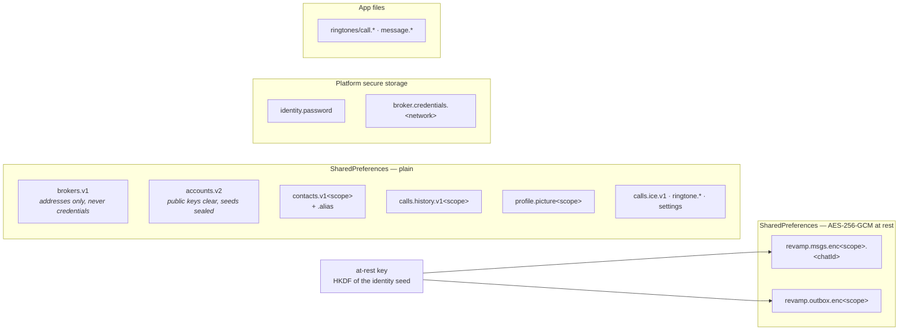

The rule the layout follows: **anything that would let somebody else in
lives in the platform keystore, never in the app's own preferences** — so a
data backup extracted off the device reveals no password and no broker
credential. Message history is encrypted under a key derived from the
identity seed, so it is unreadable without unlocking the account, and each
account's history is unreadable by the others by construction rather than by
a check that could be forgotten.

---

## 11. The server side

Optional. Two people on one WiFi never touch any of it.

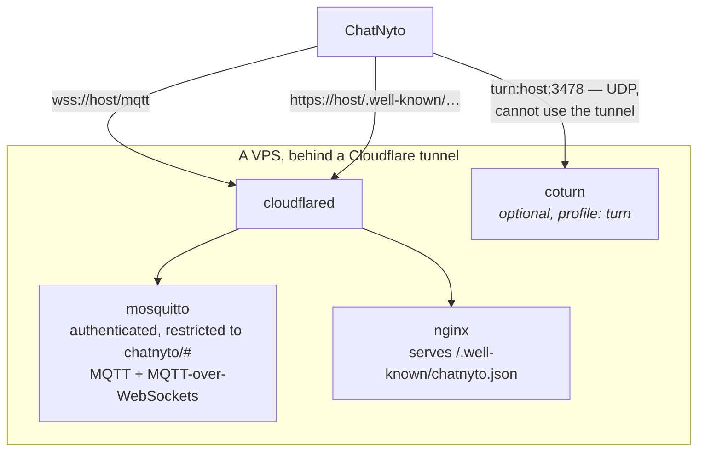

The tunnel means no port is opened for the broker at all. coturn is the one
exception — TURN is UDP and an HTTP tunnel carries no UDP — which is why it
is opt-in and needs `3478/udp`, `3478/tcp` and `49160-49200/udp` open.

`deploy/.env.prod` is the single source of truth for accounts; the password
file is rebuilt from it, so removing somebody from that variable removes
their access.

---

## 12. The AI side

A separate subsystem that shares nothing with the messaging path except the
screens it is reached from. Bring-your-own-key throughout: no ChatNyto
service sits in the middle.

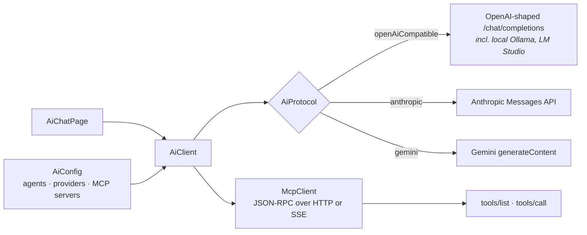

Worth noting: an agent can be pointed at a model running on the same
network, which keeps the whole conversation inside it — the same instinct as
the rest of the app.
